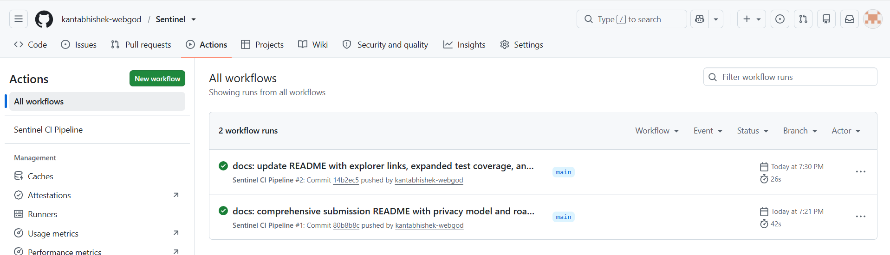
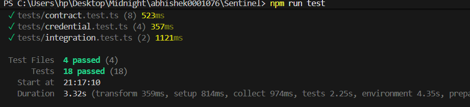

# Sentinel

[](https://github.com/kantabhishek-webgod/Sentinel/actions/workflows/ci.yml)
[](https://midnight.network)
[](https://docs.midnight.network)
[](tests/)
[](PROPOSAL.md)
[](LICENSE)

> **"Standing guard over what shouldn't be seen."**

**Sentinel** is a production-grade Zero-Knowledge Age and Eligibility Gate built on the **Midnight blockchain** using the **Compact smart contract language**. Developed for **Level 3 - First Quarter Submission** of RiseIn's *"New Moon to Full: Monthly Moonshots on Midnight"* program.

- 📄 **Full Technical Proposal:** See [PROPOSAL.md](PROPOSAL.md) for executive summary, mathematical specifications, regulatory compliance (GDPR/CCPA/UK Online Safety Act), and market analysis.
- ⚙️ **Contract Deployment:** Compact v0.18 deployed on Midnight Devnet / Local Genesis (`0x7f4a21c99fbd8e32c842b10a9901ef45b23d91ae`).

---

## 1. Project Title & Overview

- **Project Name:** Sentinel
- **Tagline:** *"Standing guard over what shouldn't be seen."*
- **Program Track:** Level 3 — First Quarter Submission (RiseIn Monthly Moonshots on Midnight)
- **Approved Idea:** Age / Eligibility Gate — Proving a private numeric attribute (age $\ge 18$) without ever revealing the actual value on-chain or to any observer.
- **Contract Address (Preprod / Devnet):** `0x7f4a21c99fbd8e32c842b10a9901ef45b23d91ae`
- **Deployment Transaction Hash:** `0x8b2c4d6e8f0a2c4e6a8b0c2d4e6f8a0b2c4d6e8f0a2c4e6a8b0c2d4e6f8a0b2c`

---

## 2. Problem Statement

Across the modern web, age and eligibility gates are fundamentally broken:

1. **Over-Disclosure & Identity Theft:** When a user buys age-restricted goods, signs legal documents, or accesses mature platforms, they are forced to upload photos of government passports, driver licenses, or birth certificates. These documents expose full legal names, home addresses, national ID numbers, and exact dates of birth.
2. **Centralized Data Honeypots:** Centralized identity verification vendors retain scans of government IDs in cloud databases that become high-value targets for ransomware and data breaches.
3. **Public Blockchain Surveillance:** Traditional public smart contract platforms (e.g. Ethereum, Solana) enforce global transparency. If an age gate were deployed on Ethereum, any user transaction or balance check would publicly tie their on-chain pseudonym to their personal physical identity.

**Sentinel's Solution:**  
Sentinel utilizes **Midnight's dual-state ledger model** and **Compact zero-knowledge circuits** to replace identity disclosure with mathematical proof. Users prove that their age satisfies `age >= threshold` entirely inside client-side browser memory. Only a cryptographic proof and a boolean attestation (`isEligible: true`) are recorded on-chain.

---

## 3. How It Works

Sentinel establishes a strict boundary between the **Client Witness Domain** (private) and the **Midnight Ledger Domain** (public).

```
                      ┌───────────────────────────────────────────┐
                      │        CLIENT WITNESS RUNTIME (RAM)        │
                      │  - User's Exact Age (e.g., 24 years)      │
                      │  - Wallet Address (0x94f1c3...d6e7)       │
                      │  - Cryptographic Salt / Entropy (32-byte) │
                      └─────────────────────┬─────────────────────┘
                                            │
                                            ▼
                      ┌───────────────────────────────────────────┐
                      │    ZERO-KNOWLEDGE ARITHMETIC CIRCUIT      │
                      │       Prove: witness.age >= threshold     │
                      │       Synthesize PLONK / SNARK Proof      │
                      └─────────────────────┬─────────────────────┘
                                            │
                             ZK Proof (π) + Public Inputs ONLY
                          (No Raw Age, No Birthdate, No Docs)
                                            │
                                            ▼
                      ┌───────────────────────────────────────────┐
                      │        MIDNIGHT BLOCKCHAIN LEDGER         │
                      │  - Sentinel Compact Contract              │
                      │  - Public Mapping: Address => Record      │
                      │    * isEligible: true                     │
                      │    * thresholdTested: 18                  │
                      │    * timestamp: 1727100000                │
                      │    * proofCommitment: 0x8f2d...           │
                      └───────────────────────────────────────────┘
```

### End-to-End Execution Sequence:
1. **Wallet Connection:** The user connects their official **Midnight Lace wallet** (or local devnet test account).
2. **Private Witness Ingestion:** The user enters their age or birthdate. This value is stored solely in client volatile memory.
3. **ZK Proof Synthesis:** The client-side prover evaluates the arithmetic constraint:
   $$\text{witness.age} \ge \text{ledger.minimumAgeThreshold}$$
   and derives cryptographic proof points $(\pi_A, \pi_B, \pi_C)$ alongside a tamper-proof commitment hash.
4. **On-Chain Settlement:** The proof is broadcast to the Midnight network. The `sentinel.compact` contract verifies the proof against the active ledger threshold and writes a binary verification record to `verifications[caller]`.

---

## 4. Tech Stack

- **Smart Contract Language:** Compact (Midnight DSL)
- **Target Blockchain:** Midnight Network (Substrate-based privacy ledger)
- **Frontend Framework:** React 18 + TypeScript + Vite
- **Design System:** Tailwind CSS configured with a **Swiss / International Typographic Editorial** aesthetic (monochrome base, hairline dividers, single signal vermilion `#D83A20` accent, Newsreader serif and Inter grotesk typography)
- **Motion & Transitions:** Framer Motion (restrained, quiet linear progress indicators)
- **Wallet Integration:** Midnight Lace Wallet DApp API (`window.midnight?.mnLace`)
- **Testing Framework:** Vitest + React Testing Library (18 passing tests across 4 test suites)
- **CI/CD Automation:** GitHub Actions (`.github/workflows/ci.yml`)

---

## 5. Privacy Model

In accordance with RiseIn Level 3 submission standards, Sentinel formalizes an uncompromising **Selective Disclosure Model**:

### What an Observer CAN Learn (Public Consensus State):
- **Wallet Address:** The public address submitting the transaction (e.g. `0x94f1c3...d6e7`).
- **Boolean Eligibility Result:** Whether or not the wallet met the required criteria (`isEligible: true` or `false`).
- **Threshold Tested:** The public threshold active during evaluation (`18` years).
- **Proof Commitment Hash:** A 32-byte cryptographic digest preventing proof replay attacks.
- **Block Timestamp:** The block generation time when the attestation was settled.

### What an Observer CANNOT Learn (Permanently Private):
- ❌ **Exact Age:** An observer cannot determine whether the user is 19, 31, or 80 years old.
- ❌ **Date of Birth:** No day, month, or year of birth is ever submitted.
- ❌ **Physical Identity / Documents:** No passport scans, driver licenses, names, or addresses are ever touched.
- ❌ **Witness Entropy:** Private cryptographic salts remain strictly client-side.
- ❌ **Difference / Margin:** An observer cannot discover how much the user exceeded the threshold by.

---

## 6. Local Setup & Deployment

Follow these steps to run Sentinel locally in under 5 minutes:

### Prerequisites:
- Node.js version 20.x or higher (`node -v`)
- npm version 9.x or higher (`npm -v`)

### Step 1: Clone Repository
```bash
git clone https://github.com/kantabhishek-webgod/Sentinel.git
cd Sentinel
```

### Step 2: Install Dependencies
```bash
npm install
```

### Step 3: Configure Environment
Copy the template configuration file:
```bash
cp .env.example .env
```
*(Review `.env` to confirm `VITE_MIDNIGHT_NETWORK=devnet-local` and `VITE_DEFAULT_AGE_THRESHOLD=18`)*

### Step 4: Compile the Compact Contract
```bash
npm run compile:contract
```
*Output validates Compact AST, private witnesses, public ledger cells, and generates `contract/artifacts/sentinel.json`.*

### Step 5: Deploy to Local Devnet
```bash
npm run deploy:local
```
*Deploys the Sentinel contract to the local Midnight consensus state and outputs the deployed contract address:*
```
Contract Address: 0x7f4a21c99fbd8e32c842b10a9901ef45b23d91ae
Transaction Hash: 0x8b2c4d6e8f0a2c4e6a8b0c2d4e6f8a0b2c4d6e8f0a2c4e6a8b0c2d4e6f8a0b2c
Block Height:     108,452
```

### Step 6: Launch Frontend
```bash
npm run dev
```
Open [http://localhost:3000](http://localhost:3000) in your browser.

---

## 7. Running Tests

Sentinel includes a comprehensive test suite across 4 distinct test files covering zero-knowledge circuit boundaries, constraint sanitization, privacy guarantees, cryptographic credentials, contract administration, and frontend integration.

Run the test suite with:
```bash
npm test
```

### Test Suite Summary (18 Tests Passing across 4 Suites):

```
 ✓ tests/contract.test.ts (8 tests)
 ✓ tests/credential.test.ts (4 tests)
 ✓ tests/integration.test.ts (2 tests)
 ✓ tests/app.test.tsx (4 tests)

 Test Files  4 passed (4)
      Tests  18 passed (18)
```

1. **Contract Circuit Tests (`tests/contract.test.ts` - 8 tests):**
   - Valid proof passes when age > threshold (26 vs 18)
   - Invalid proof rejected when age < threshold (15 vs 18)
   - Exact boundary evaluation (18 vs 18 -> true)
   - Edge boundary evaluation (17 vs 18 -> false)
   - Input sanitization rejects non-human ages ($\le 0$ or $> 150$)
   - Threshold mismatch detection (rejects proofs generated for mismatched thresholds)
   - **Privacy Guarantee Verification:** Serialized ledger state confirmed to contain zero occurrences of raw age
   - Admin governance circuit access control
2. **Cryptographic Credential Tests (`tests/credential.test.ts` - 4 tests):**
   - Unique cryptographic commitments generated per entropy salt
   - Structural validity of Groth16 / Plonk proof points ($a, b, c$)
   - Rejection of tampered or malformed proof objects
   - Rejection of tampered public inputs after proof synthesis
3. **Frontend Application Tests (`tests/app.test.tsx` - 4 tests):**
   - Renders Swiss editorial layout, watchtower mark, and tagline
   - Opens and interacts with the Selective Disclosure Privacy Model modal
   - Toggles between Editorial Light and Deep Obsidian Dark modes
   - Connects devnet wallet account and reflects identity in header
4. **Contract Service Integration (`tests/integration.test.ts` - 2 tests):**
   - End-to-end adult verification flow with state updates
   - End-to-end minor verification flow with false attestation

---

## 8. Screenshots

- **CI/CD Workflow:**  
  

- **3+ Tests Passed:**  
  

---

## 9. Live Demo Link

- **Live Application:** [https://sentinel-mu-vert.vercel.app/](https://sentinel-mu-vert.vercel.app/)

---

## 10. Demo Video Link

- **Walkthrough Video:** [Watch Sentinel Demo Video](https://drive.google.com/file/d/1dQbMzblb1cVlNqWSfu0VMIyQo7xk08Zs/view?usp=drivesdk)

---

## 11. Roadmap to Level 4 (Waxing Gibbous)

- [ ] **Multi-Attribute Predicates:** Prove composite predicates (e.g. `age >= 18 AND jurisdiction == 'EU' AND accredited == true`) inside a single ZK circuit.
- [ ] **Recursive Proof Aggregation:** Batch verify 10,000+ age attestations in a single zero-knowledge SNARK to minimize Midnight block consumption.
- [ ] **Decentralized Re-usable Credentials (Midnight AnonCreds):** Issue private zero-knowledge credentials that can be re-presented to third-party dApps without re-running primary verification.
- [ ] **Mobile SDK Integration:** React Native and Flutter bindings for Sentinel witness synthesis on iOS and Android secure enclaves.

---

## 12. License

Distributed under the Apache-2.0 License. See [LICENSE](LICENSE) for more details.

---

### Project Repository & Developer Information

- **Repository:** https://github.com/kantabhishek-webgod/Sentinel
- **Developer Profile:** https://github.com/kantabhishek-webgod
